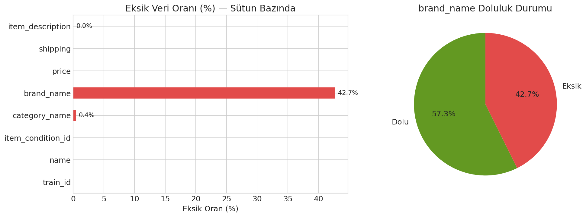
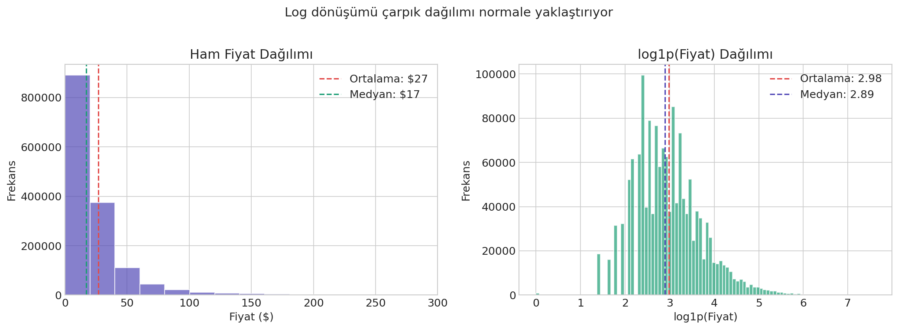
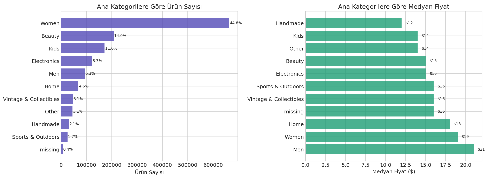
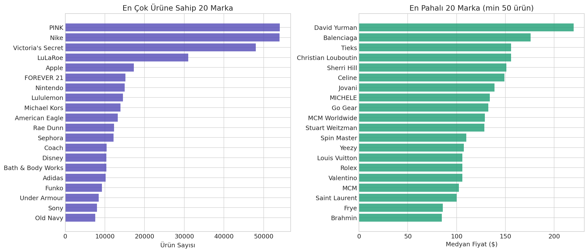
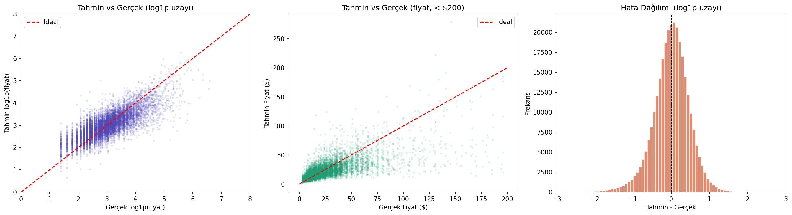
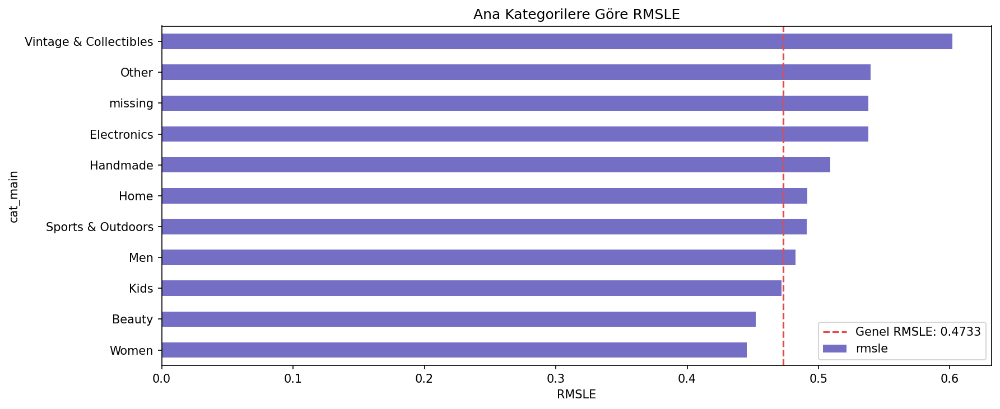
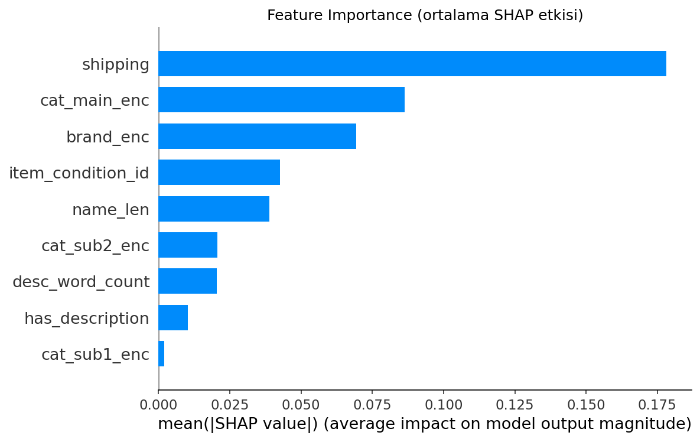
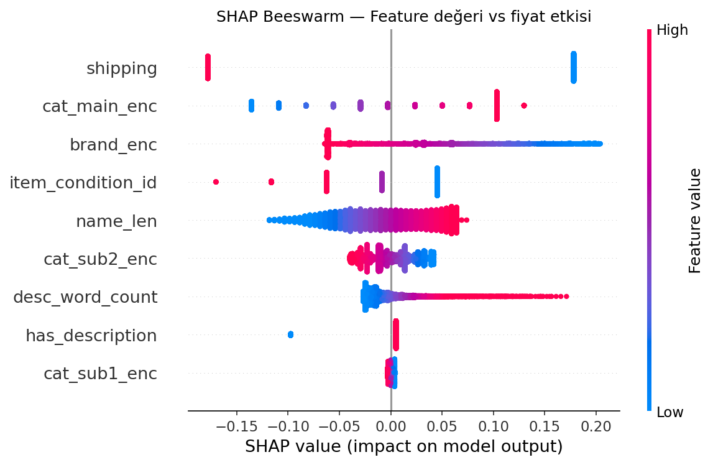

# Mercari Price Prediction

A machine learning project to automatically suggest product prices on Mercari marketplace.

## 📊 Results
| Model | RMSLE |
|-------|-------|
| Ridge Regression | ~0.50 |
| LightGBM + TF-IDF | **0.4733** |

## 🔧 Methods
- **EDA**: Missing value analysis, price distribution, category & brand analysis
- **Feature Engineering**: TF-IDF (name + description), SVD, Label Encoding
- **Models**: Ridge Regression, LightGBM with Cross-Validation
- **Explainability**: SHAP values

## 📁 Project Structure
notebooks/
├── 01_eda.ipynb
├── 02_feature_engineering_model.ipynb
├── 03_lightgbm_cv.ipynb
├── 04_shap_analysis.ipynb
└── 06_score_improvement.ipynb
src/
├── api/
└── ui/streamlit_app.py

## 🛠️ Tech Stack
Python, LightGBM, Scikit-learn, SHAP, TF-IDF, Docker

## 📈 Key Visualizations

### Missing Data & Price Distribution

### Categories & Brands

### Model Results

### SHAP Analysis

## 🎯 Presentation
[📊 View Full Presentation](reports/presentation.html)
